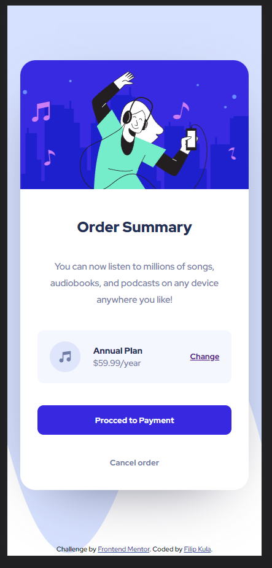

# Frontend Mentor - Order summary card solution

This is a solution to the [Order summary card challenge on Frontend Mentor](https://www.frontendmentor.io/challenges/order-summary-component-QlPmajDUj). Frontend Mentor challenges help you improve your coding skills by building realistic projects. 

## Table of contents

- [Overview](#overview)
  - [The challenge](#the-challenge)
  - [Screenshot](#screenshot)
  - [Links](#links)
- [My process](#my-process)
  - [Built with](#built-with)
  - [What I learned](#what-i-learned)
  - [Continued development](#continued-development)
- [Author](#author)

## Overview

### The challenge

Users should be able to:

- See hover states for interactive elements

### Screenshot
Desktop design:

Mobile design:

### Links

- Solution URL: [Add solution URL here](https://your-solution-url.com)
- Live Site URL: [tucznik2.github.io](https://tucznik2.github.io/order-summary-component/)

## My process

### Built with

- Semantic HTML5 markup
- CSS custom properties
- Flexbox
- CSS Grid
- Mobile-first workflow

### What I learned

- Implementing variables in CSS
- Responsive Web Design
- Mobile first

### Continued development

I would like to learn more about JS in the future.

## Author

- Github - [Filip Kula](https://github.com/Tucznik2)
- Frontend Mentor - [Tucznik2](https://www.frontendmentor.io/profile/Tucznik2)

